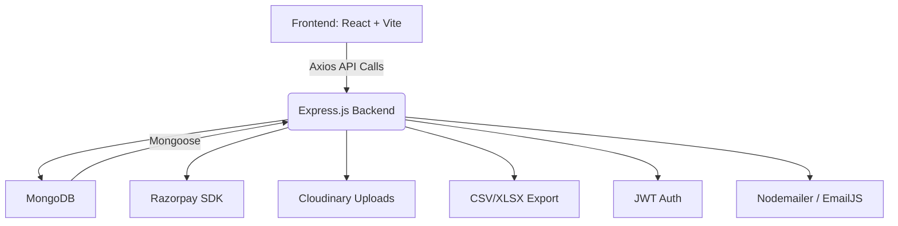

# 🌙 Attacus & Psyche

> A bespoke event management platform for night walks under the stars.


---


---

## 🛍️ About

**Attacus & Psyche** is a full-stack platform to manage **night walk conservation events**.  
Users can browse curated events, register guests, make secure payments, and admins can manage participant data effortlessly.

Built with performance and user experience in mind - both frontend and backend are modern, secure, and elegant.

---

## 🌟 Features

- 🌌 Curated display of night walk events  
- 🛒 Add to cart & register participants  
- 💳 Seamless **Razorpay** payment integration  
- 🔒 **JWT-based authentication**  
- 🔐 Secure password hashing using `bcrypt`  
- 🍪 Auth stored in **HTTP-only cookies**  
- 🧾 Downloadable participant data (`CSV`) & order history (`XLSX`)  
- 📤 Admin export tools for event management  
- 📱 Fully responsive design via **Tailwind CSS**  
- 📸 Cloudinary image uploads for events or profiles  

---

## ⚙️ Tech Stack

### 🖥 Frontend – React + Vite + Tailwind

- React 19  
- Vite  
- Tailwind CSS 4  
- Axios  
- React Router DOM  
- EmailJS  
- Lucide Icons  

### 🌐 Backend – Express + MongoDB

- Express 5  
- MongoDB & Mongoose  
- Razorpay SDK  
- JSON Web Tokens (JWT)  
- bcrypt  
- Multer + Cloudinary  
- Nodemailer / React Email  
- json-2-csv & xlsx for export features  

---

## 🗂️ System Architecture



✅ Built with modular separation of concerns and scalable exports/auth/payment workflows.

## 📦 Project Structure
```
/frontend
  ├── src/
  │   ├── pages
  │   ├── components/
  │   ├── services/ (API)
  │   └── assets/

  /Emails
    ├── Email.html
  
 /backend
  ├── controllers/
  ├── models/
  ├── routes/
  ├── utils/
  └── index.js
```

### 📸 Live Demo
🌐 Frontend → Functioning Master [deployement](https://attacus-and-psyche.vercel.app/)

### 🖥️ Backend → Deployed on Render.

## 🚧 Current Status
We’re still adding features, testing, debugging, and ensuring the platform is stable and robust.  A significant amount of work remains, but around 90% of the project is complete.

✨ Contributors
<table> <tr> <td align="center"> <a href="https://github.com/mayur-driod">  <br /> <sub><b>mayur k setty</b></sub> </a><br />👑 Project Lead </td> </tr> </table>

### 📃 License
This project is licensed under the MIT License.

### 📬 Contact
For feedback, bugs, or collaborations:
📧 settymayurk@gmail.com
[🔗 LinkedIn](https://www.linkedin.com/in/mayurksetty/)

Feel free to fork this repository and submit PR's as contributions. Follow the Contributions.md for PR's to get accepted.

🌏 *made with ❤️ in India by Mayur.*
  

